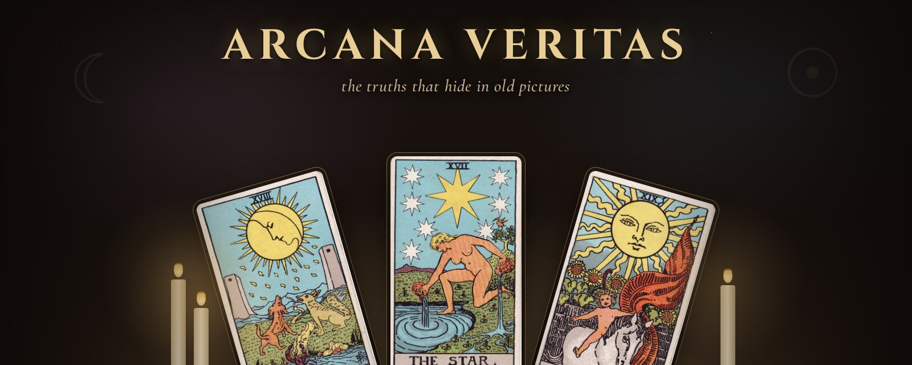
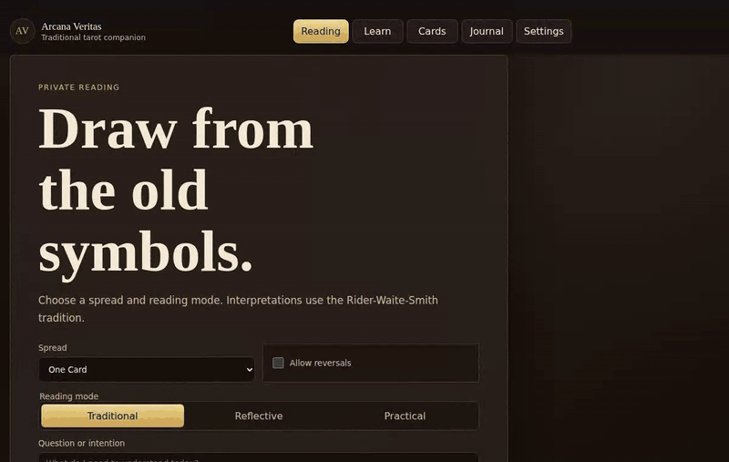
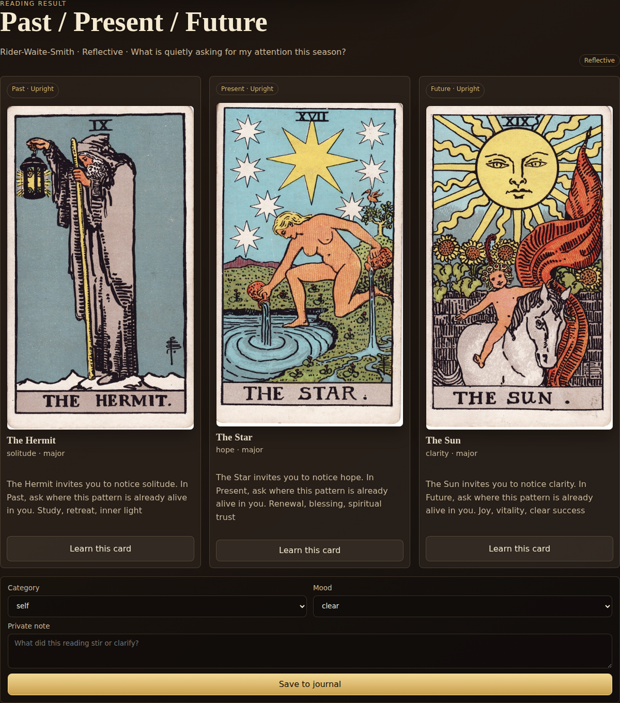
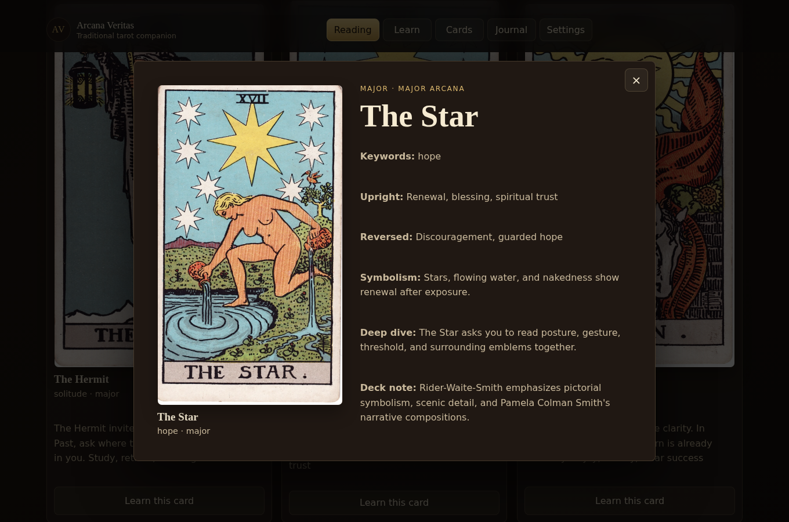
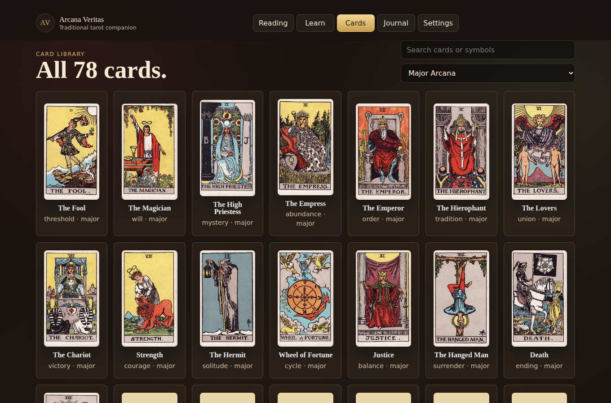
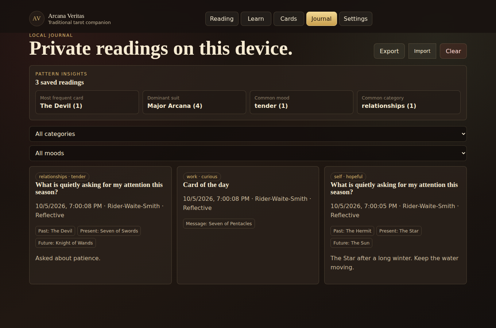
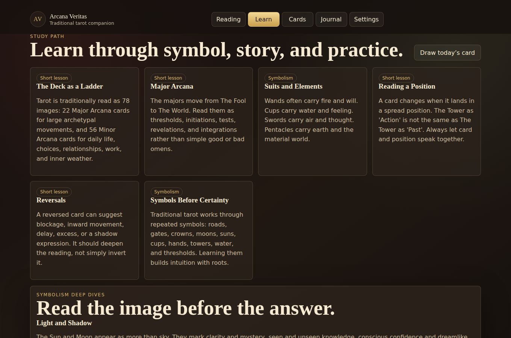
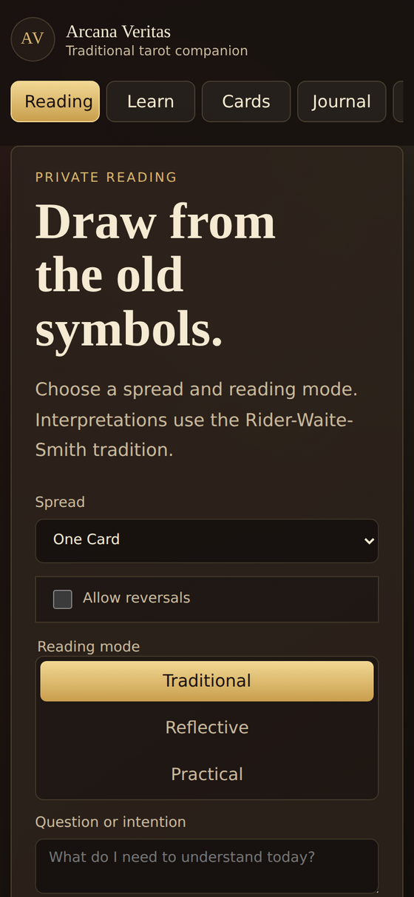
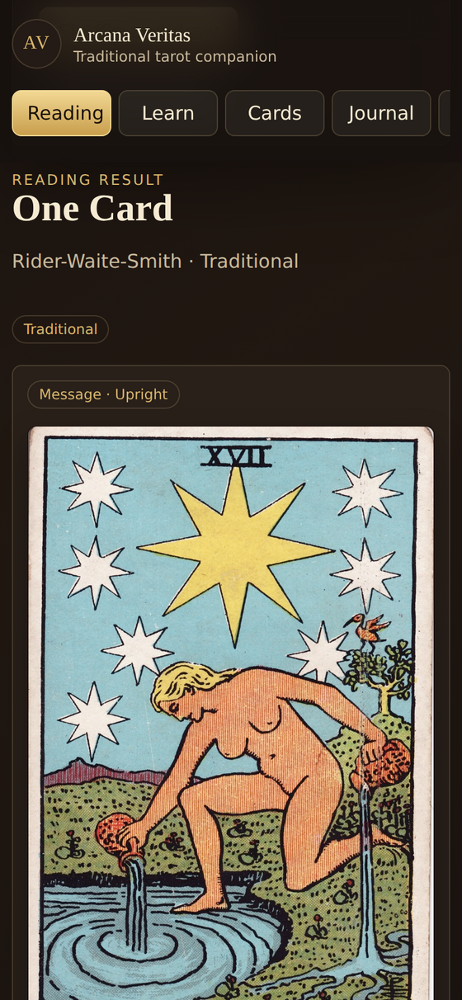

<p align="center">
  
</p>

<p align="center">
  <em>A traditional tarot companion for spiritual insight, symbolic learning, and private reflection.</em>
</p>

<p align="center">
  <a href="https://tarot-table.netlify.app"><strong>✦ Open the live app ✦</strong></a>
  &nbsp;·&nbsp; free &nbsp;·&nbsp; no login &nbsp;·&nbsp; no ads &nbsp;·&nbsp; works offline
</p>

---

> *The candle is lit. The deck is old, older than the table it rests on, its edges soft from a century of hands.*
>
> *You do not come here for a prophecy. You come with a question you have been carrying around for a while, and you lay three pictures down to see what it looks like from the outside. A woman pours water back into the pool beneath a sky full of stars. A hermit holds up a lantern on a cold ridge. A child rides out under a blazing sun.*
>
> *The cards don't tell you what will happen. They give you better words for what is already happening.*

**Arcana Veritas** (*"the truths of the arcana"*) is an installable tarot web app built around the **Rider-Waite-Smith** tradition, not novelty fortune-telling. It uses Pamela Colman Smith's 1909 artwork, authored interpretations, short lessons on symbolism, and a journal that stays private on your device.

<p align="center">
  
</p>

## At the table

### Ask, shuffle, draw

Choose a spread, pick a reading voice, and write down what you're carrying. Each card speaks from its position, so The Tower as *Action* reads differently from The Tower as *Past*.

<p align="center">
  
</p>

### Sit with a single card

Tap any card for its keywords, upright and reversed meanings, symbolism, and notes on how to read it.

<p align="center">
  
</p>

### Walk the whole deck

All 78 cards, searchable by name or symbol and filterable by arcana or suit.

<p align="center">
  
</p>

### Keep a private journal

Save readings with a mood, a category, and a note. Over time the journal shows your patterns: recurring cards, the dominant suit, the moods you tend to bring to the table. It all stays in your browser, and you can export or import it as JSON.

<p align="center">
  
</p>

### Learn the language

Short lessons on the structure of the deck, suits and elements, positions, reversals, and the symbols that keep coming back: thresholds, crowns, hands, light and shadow.

<p align="center">
  
</p>

### In your pocket

Install it on your phone's home screen. It's designed for one-handed use and keeps working offline.

<p align="center">
  
  &nbsp;&nbsp;
  
</p>

## Features

- **Spreads:** One Card, Past / Present / Future, Situation / Action / Outcome, Yes / No / Maybe
- **Card of the day:** the same card (and orientation) for the whole day
- **Three reading voices:** Traditional, Reflective, Practical
- **Optional reversals**
- **Authored interpretations** for all 78 cards, with symbolism and deep-dive notes
- **Historical artwork:** public-domain 1909 scans, with generated study art as a fallback
- **Lessons** and **symbolism deep dives**
- **Private journal** with moods, categories, filters, pattern insights, and JSON import/export
- **Optional "Real reading":** an AI synthesis of the whole spread through OpenAI or Claude, using **your own API key**
- **Installable PWA** that works offline

## The Vibe

Mystic, but rooted in tradition.

It should feel like opening an old deck at a quiet table: warm, respectful, symbolic, and focused on the cards. Dark walnut and candle-gold, serif headings, and Pamela Colman Smith's line work at the centre of every screen. There are no ads, no login walls, and no streak counters.

## Philosophy

Arcana Veritas treats tarot as a symbolic and spiritual practice. It is **not** medical, legal, financial, or crisis advice. The readings are written to support reflection, learning, and discernment, not certainty or fear.

## Artwork

The Rider-Waite-Smith deck uses public-domain historical scans from the Pamela Colman Smith / A. E. Waite 1909 tarot, loaded through Wikimedia Commons `Special:FilePath` URLs. If a scan can't load, the app falls back to generated study artwork so no card face is ever blank.

## Privacy and AI readings

- Your journal lives only in your browser's `localStorage`.
- AI readings are optional and use **bring your own key**. Keys never ship with the app. A remembered key is kept in `localStorage`; otherwise it lives in `sessionStorage` and disappears when you close the browser.
- During a Real reading, your question, the drawn cards, and your key go to this app's Netlify Function, which forwards them to the provider you chose. The function doesn't store anything.

## Tech

A small static PWA with no framework, no build step, and no accounts:

- HTML, CSS, and vanilla JavaScript (ES modules)
- Web app manifest and service worker (network-first app shell, offline fallback)
- One Netlify Function (`netlify/functions/ai-reading.js`) for BYOK AI calls
- Netlify static deploy

## Local development

Serve the project folder with any static server:

```sh
python -m http.server 5173 --bind 127.0.0.1
```

Then open <http://127.0.0.1:5173/>.

AI readings need the Netlify Function, so use `netlify dev` if you want to try them locally.

## Deployment

The live site runs on Netlify: **[tarot-table.netlify.app](https://tarot-table.netlify.app)**

Netlify reads [`netlify.toml`](./netlify.toml) and publishes the repository root as a static site.

## Roadmap status

- Single Rider-Waite-Smith deck flow: implemented.
- Richer card-specific symbolism lessons: implemented with card deep dives.
- Card pattern insights from the private journal: implemented locally.

See [`TAROT_PWA_PLAN.md`](./TAROT_PWA_PLAN.md) for the full product plan.

## License

[MIT](./LICENSE) for the code. The 1909 Rider-Waite-Smith artwork is in the public domain in the US and UK; check your own jurisdiction before reusing it.

<p align="center"><sub>☾ &nbsp; ✦ &nbsp; ☀</sub></p>
